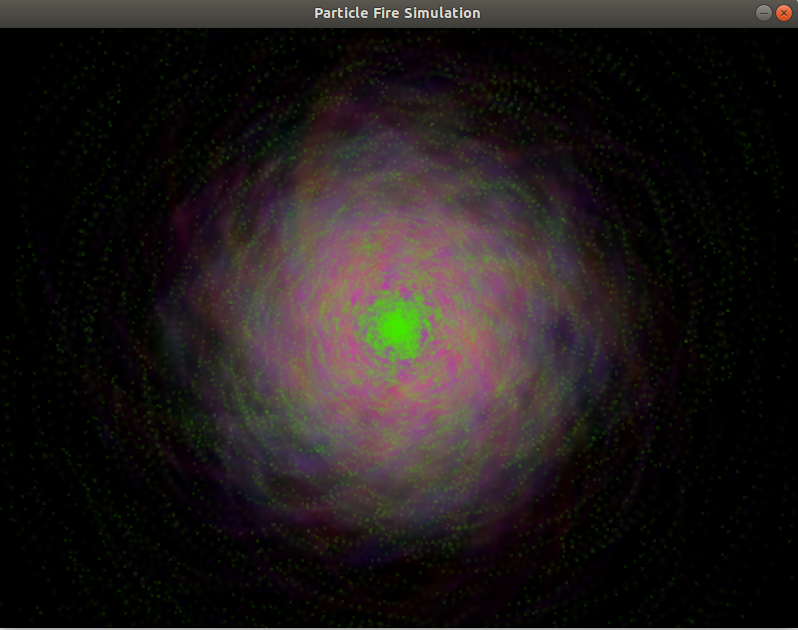
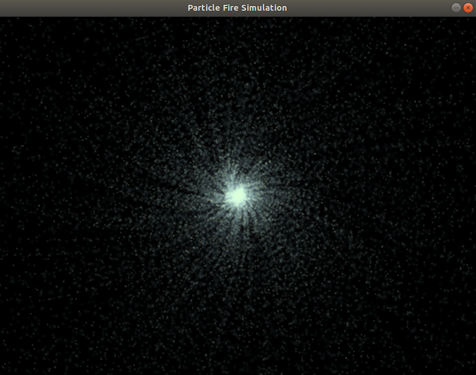
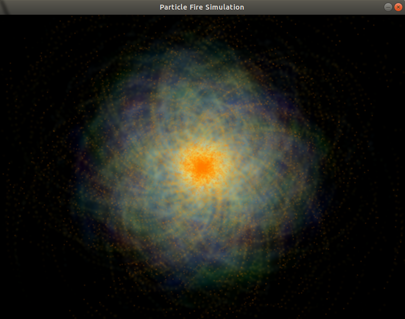

# ParticleFireSimulation

The final project of the **C++ Tutorial for Complete Beginners** course from **Udemy** ([link](https://www.udemy.com/course/free-learn-c-tutorial-beginners/))

## Details about the project

 - *Project's objective*: Implement a visual simulation of a particle explosion
 - *Programming language*: **C++**
 - *IDE used*: **Eclipse IDE 2020-03**
 - *Third-party libraries used*: 
	 - **SDL (Simple DirectMedia Layer)** ([link](https://www.libsdl.org/)): provides an API for working with pixel level graphics
 - *Implementation details*:
	 - ***mainApp.cpp*** is the main file of the project which contains an infinite loop (this loop is stopped when the window in which the simulation is shown is closed) 
	 - 3 classes are defined and used: 
		 - **Screen** (***Screen.h***, ***Screen.cpp***) for screen rendering and interaction with the screen (i.e. the graphics window)
		 - **Swarm** (***Swarm.h***, ***Swarm.cpp***) for manipulating the swarm of multiple particles
		 - **Particle** (***Particle.h***, ***Particle.cpp***) for manipulating a single particle
	 - For using the *SDL* thrid-party library, the path of the header file had to be set (in *GCC C++ Compiler* -> *Includes*), as well as the path and the name of the static library (in *C++ Linker* -> *Libraries*) in the project's settings in the used IDE
	 - The simulation can be modified using the following parameters:
		 -  *NPARTICLES* (*Swarm.h*): The number of particles
		 - *RVARIATIONFACTOR*, *GVARIATIONFACTOR*, *BVARIATIONFACTOR* (*Particle.h*): The variation factors for R, G and B values which define the color of the particles
		 - *RESPAWNRATE* (*Particle.h*): The factor which defines whether a particle should be respawned in the middle of the window or not at each iteration
		 - *SPEEDFACTOR* (*Particle.h*): The factor which defines the speed of a particle
		 - *DIRECTIONFACTOR* (*Particle.h*): The factor which defines the direction of a particle
 - Results (Screenshots):

